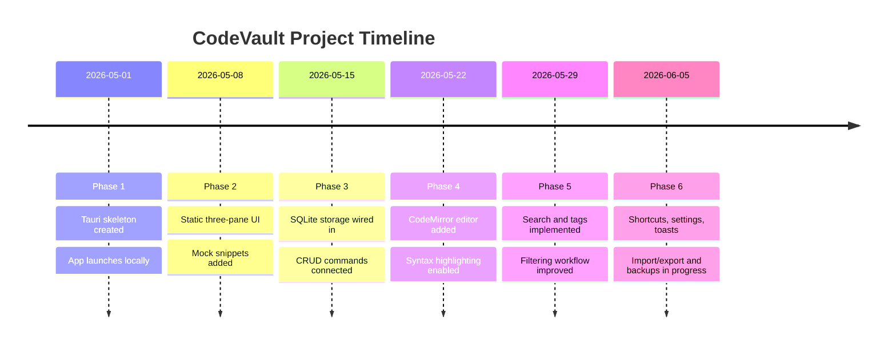
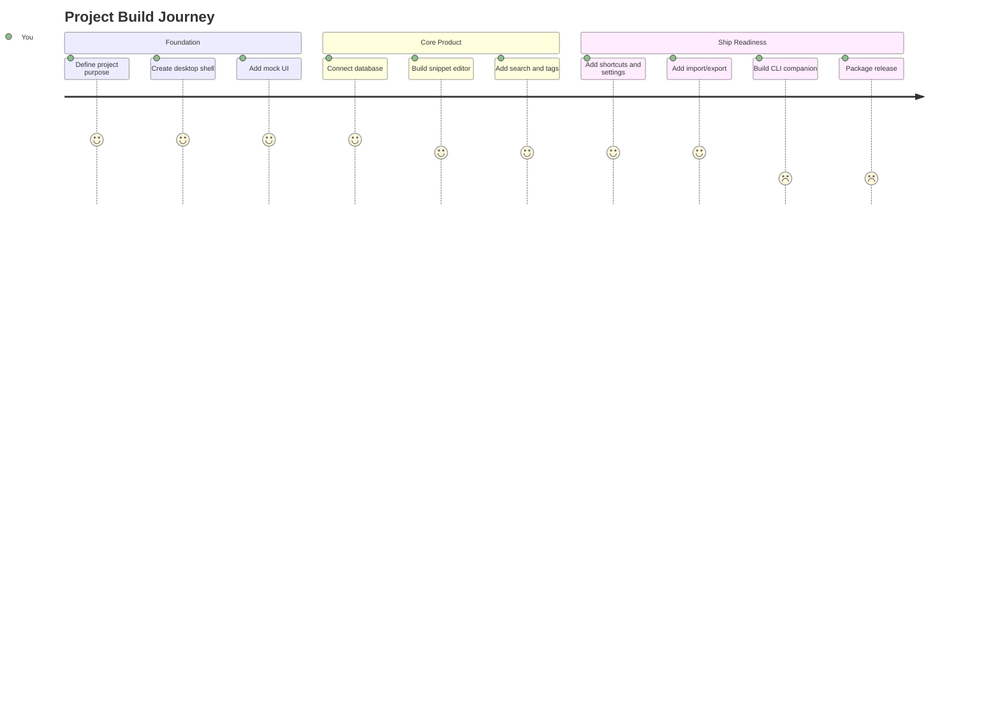

# Project Timeline Template

Use this file as a living roadmap for a project. Keep the entries short, dated, and outcome-focused so the diagram stays useful as the project grows.

## How To Use

- Copy this file into a new project as `docs/PROJECT_TIMELINE.md`.
- Replace the example project name, phases, and dates.
- Update the timeline when a major decision, feature, release, or blocker happens.
- Keep detailed implementation notes in separate docs, then link them from the entries below.

## Project Snapshot

| Field | Example |
| --- | --- |
| Project | CodeVault |
| Purpose | Local-first desktop snippet manager |
| Current phase | Polish and packaging |
| Next milestone | CLI companion |
| Last updated | 2026-06-05 |

## Timeline

## Roadmap

```mermaid
flowchart LR
    idea["Idea"]
    skeleton["App Skeleton"]
    ui["Core UI"]
    data["Local Storage"]
    editor["Editor Experience"]
    search["Search + Tags"]
    polish["Polish + Packaging"]
    cli["CLI Companion"]
    release["Release"]

    idea --> skeleton --> ui --> data --> editor --> search --> polish --> cli --> release

    skeleton:::done
    ui:::done
    data:::done
    editor:::done
    search:::done
    polish:::active
    cli:::next
    release:::future

    classDef done fill:#d9f99d,stroke:#3f6212,color:#1a2e05
    classDef active fill:#bfdbfe,stroke:#1d4ed8,color:#172554
    classDef next fill:#fde68a,stroke:#b45309,color:#451a03
    classDef future fill:#e5e7eb,stroke:#6b7280,color:#111827
```

## Decision Log

| Date | Decision | Reason | Follow-up |
| --- | --- | --- | --- |
| 2026-05-01 | Use Tauri + React | Native desktop feel with web UI speed | Keep Rust commands small and typed |
| 2026-05-15 | Store data in SQLite | Local-first persistence without a server | Add backup and import/export paths |
| 2026-05-22 | Use CodeMirror 6 | Strong editor behavior and language support | Add themes and keyboard polish |

## Milestone Status

## Weekly Build Notes

### 2026-06-05

**Shipped:** Shortcuts, command palette, toasts, import/export, settings, and launch backups.

**Learned:** Project history is easier to understand when each phase has a short outcome, not a long implementation diary.

**Next:** Finish the CLI companion and verify packaged builds.

## Template Prompts

Use these prompts when updating the file:

- What changed this week?
- What decision did I make, and why?
- What is now finished enough to mark as done?
- What is blocked?
- What is the next visible milestone?

